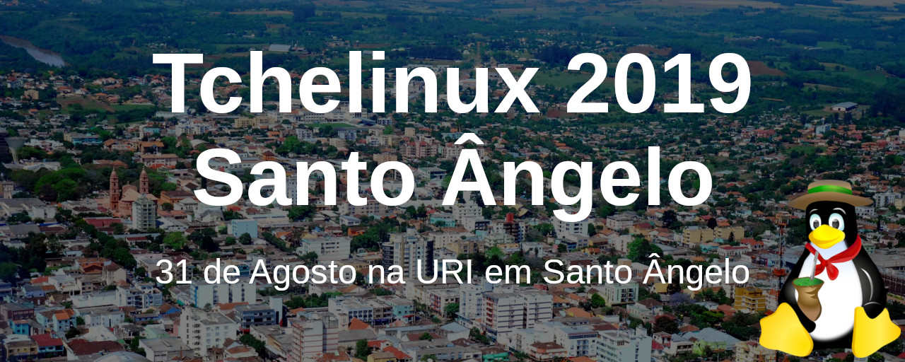
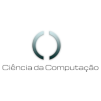
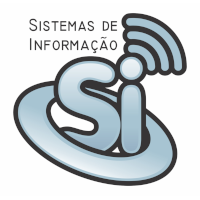

## Sobre

O grupo de usuários de Software Livre Tchelinux, em parceria com a [**Universidade Regional Integrada do Alto Uruguai e das Missões Campus Santo Ângelo**](http://santoangelo.uri.br), tem o prazer de convidar a comunidade para participar do evento que ocorrerá no dia **31 de Agosto de 2019 a partir das 8:30h** na URI em Santo Ângelo.

## Chamada de Trabalhos

A Chamada de Trabalhos está aberta e o prazo para submissão de propostas de palestra é 28 de Julho de 2019. Os trabalhos escolhidos serão anúnciados no dia 29 de Julho de 2019.

[**Clique aqui e submeta sua palestra agora mesmo!**](https://santoangelo.tchelinux.org/cfp/)

## Inscrições

As inscrições estarão abertas a partir do dia 1° de Julho, quando a **programação do evento** for anunciada.

O evento tem **entrada franca**, porém os participantes são encorajados a doar 2kg de alimentos não perecíveis (exceto sal), que são doados a instituições de caridade da região.

Os alimentos são recebidos no momento do credenciamento.

## Certificados

Serão fornecidos certificados digitais para os participantes do evento, que confirmaram sua presença. Para obtê-los, você deverá utilizar o email fornecido na sua inscrição para o evento.

**Importante:** Não esqueça de confirmar sua presença no credenciamento.

## Local

> **URI Santo Ângelo**
> Av. Universidade das Missões, 464
> Santo Ângelo - RS

	<iframe src="https://www.google.com/maps/embed?pb=!1m18!1m12!1m3!1d11818.547494409933!2d-54.276312153221255!3d-28.277864143627372!2m3!1f0!2f0!3f0!3m2!1i1024!2i768!4f13.1!3m3!1m2!1s0x94fe90ad442677b9%3A0x90151770d37dcdf8!2sAv.+Universidade+das+Miss%C3%B5es%2C+464+-+Dornelles%2C+Santo+%C3%82ngelo+-+RS%2C+98802-470!5e0!3m2!1sen!2sbr!4v1559070886924!5m2!1sen!2sbr" width="600" height="480" frameborder="0" style="border:0" allowfullscreen></iframe>

## Apoio

### Institucional

### Divulgação

